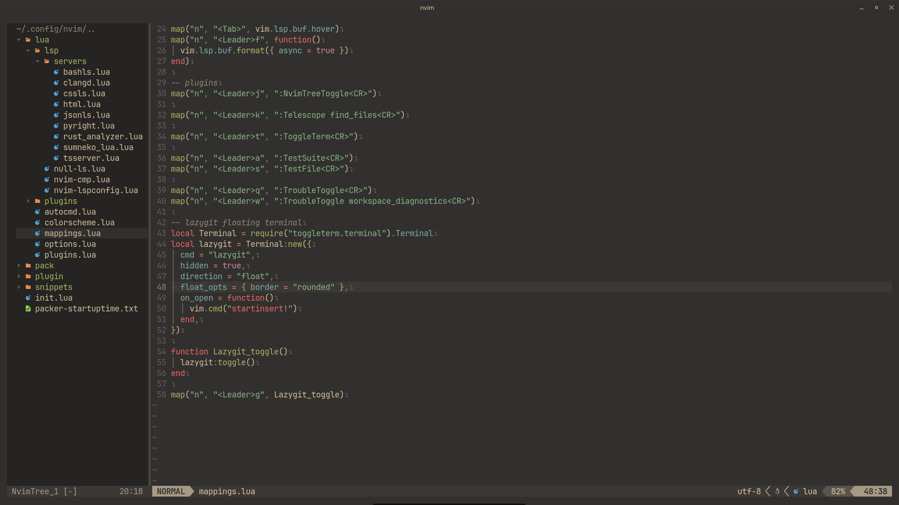
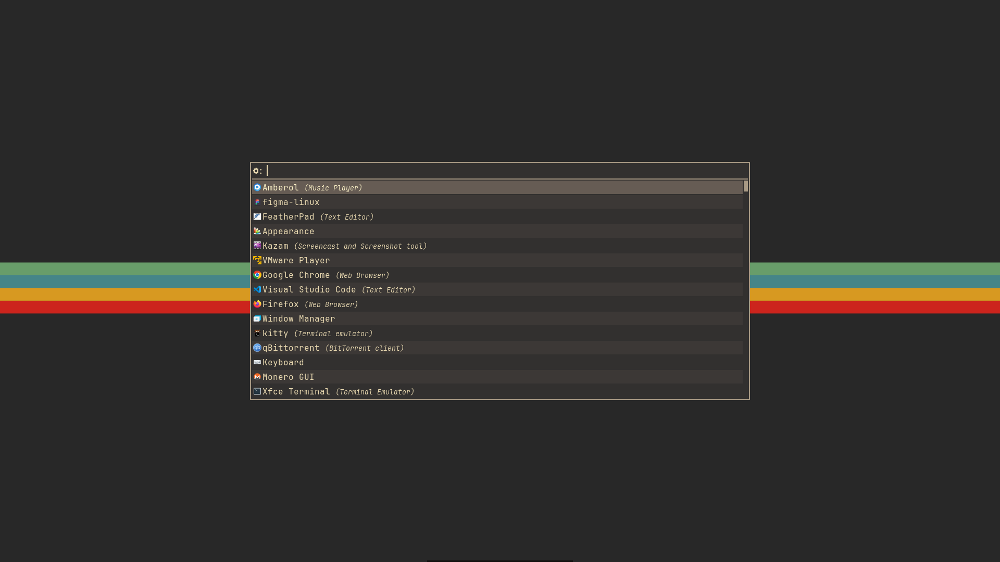

## dotfiles 💡

my day to day configuration based on the gruvbox theme

I keep changing my neovim configuration so I can't promise the one in this repo is fully up to date

#### details

- wm - xfwm
- editor - [neovim](https://github.com/neovim/neovim)
- terminal - [kitty](https://github.com/kovidgoyal/kitty)
- launcher - [rofi](https://github.com/davatorium/rofi)
- font - JetBrainsMono Nerd Font
